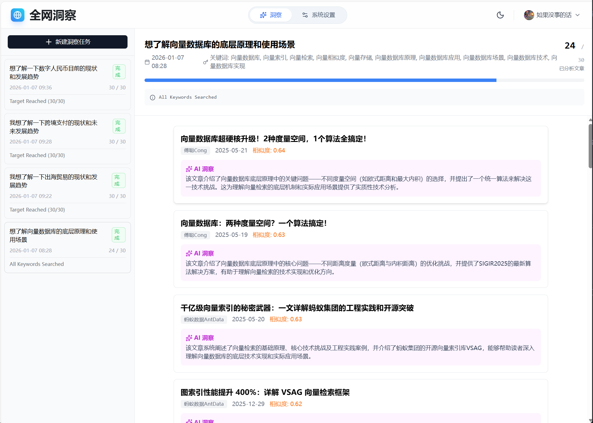

# 微信文章全网洞察

<p align="center">
  
</p>

<p align="center">
  <a href="https://github.com/longlongyang/wechat-article-insight/stargazers"></a>
  <a href="https://github.com/longlongyang/wechat-article-insight/network/members"></a>
  <a href="https://github.com/longlongyang/wechat-article-insight/blob/main/LICENSE"></a>
</p>

**AI 驱动的微信公众号文章智能发现工具**。输入研究主题，自动发现全网相关高质量文章。

## ✨ 核心功能

- 🧠 **AI 智能发现** - 输入研究主题，AI 自动生成关键词搜索全网公众号
- 🎯 **语义排序** - 基于向量相似度筛选最相关文章
- 🔬 **深度分析** - AI 对每篇文章进行相关性评分和洞察提取
- 📥 **多格式导出** - 支持 Markdown / PDF 批量导出
- ⚡ **实时进度** - 实时显示任务进度和发现的文章

<p align="center">
  
</p>

## 🎬 工作流程

```
输入研究主题 → AI 生成关键词 → 搜索公众号 → 获取文章 → 语义相似度筛选 → AI 洞察分析 → 导出结果
```

## 🛠️ 技术栈

| 组件 | 技术 |
|------|------|
| **前端** | Nuxt 3 + Nuxt UI |
| **后端** | Rust + Axum + SQLx |
| **数据库** | PostgreSQL + pgvector |
| **AI** | Gemini / DeepSeek / Ollama |

## 📋 环境要求

| 依赖 | 版本 | 用途 |
|------|------|------|
| **Node.js** | ≥ 22 | 前端运行 |
| **Rust** | ≥ 1.75 | 后端编译 |
| **PostgreSQL** | ≥ 15 | 数据存储 |
| **pgvector** | ≥ 0.5 | 向量搜索扩展 |
| Prince XML | 可选 | PDF 导出 |

## 🚀 快速开始

> **阅读时间：5 分钟 | 部署时间：10 分钟**

### 📦 前置准备

在开始之前，请确保您已准备好以下账户和工具：

#### 1️⃣ 微信公众号账户 (必需)

本工具需要通过微信公众平台的搜索接口获取文章，您需要拥有一个公众号账户。

- **注册地址**：[微信公众平台](https://mp.weixin.qq.com/)
- **账户类型**：订阅号 / 服务号 均可（个人订阅号即可）
- **为什么需要**：系统使用您的公众号权限调用微信搜索 API

> ⚠️ 本程序**不会**利用您的公众号发送消息或进行任何写操作，仅用于搜索和读取公开文章。

#### 2️⃣ Cloudflare 账户 (必需)

微信 API 存在访问限制，需要通过 Cloudflare Workers 代理来稳定访问。

- **注册地址**：[Cloudflare 注册](https://dash.cloudflare.com/sign-up)
- **费用**：免费套餐足够使用
- **部署指南**：参考 [tools/deploy-workers/README.md](tools/deploy-workers/README.md)

#### 3️⃣ AI API Key (二选一)

系统需要 AI 服务进行关键词生成、文章分析和向量嵌入。

| 方案 | 推荐度 | 说明 |
|------|--------|------|
| **Gemini API** | ⭐⭐⭐ 推荐 | 免费额度充足，需要代理访问 |
| **DeepSeek API** | ⭐⭐ 备选 | 国内直连，按量付费 |

**获取 API Key：**
- Gemini：[Google AI Studio](https://aistudio.google.com/apikey)
- DeepSeek：[DeepSeek 开放平台](https://platform.deepseek.com/api_keys)

> 💡 **本地 Embedding**：可安装 [Ollama](https://ollama.ai/) 替代云端向量嵌入服务，详见 [Ollama 配置指南](docs/OLLAMA_SETUP.md)。目前仅支持 Embedding，其他 AI 功能仍需云端 API。<!-- TODO: 支持 Ollama 进行关键词生成和文章分析 -->

#### 4️⃣ HTTP 代理 (必需)

由于 Cloudflare Workers 服务器位于海外，需要配置 HTTP 代理才能正常访问。

- **代理地址**：通常为 `http://127.0.0.1:7890`（以实际为准）
- **作用范围**：
  - 访问 Gemini API（AI 服务，如使用 Gemini API）
  - 访问 Cloudflare Workers（拉取微信文章正文）

> 💡 如果您使用 **DeepSeek API** 替代 Gemini，仍需代理访问 Cloudflare Workers。
> 
> 💡 **纯国内方案**：如果您完全无法配置代理，可以考虑自建国内服务器转发微信请求，但这需要额外开发。

---

### 🐳 Docker Compose 一键部署

#### 步骤 1：克隆仓库

```bash
git clone https://github.com/longlongyang/wechat-article-insight.git
cd wechat-article-insight
```

#### 步骤 2：配置代理端口（可选）

如果您的代理端口不是默认的 `7890`，需要修改 `docker-compose.yml` 中的端口号：

```yaml
# docker-compose.yml 第 41 行
HTTPS_PROXY: http://host.docker.internal:7890  # 将 7890 改为您的代理端口
```

> ⚠️ **重要**：不要修改 `host.docker.internal` 部分！这是 Docker 容器访问宿主机的特殊地址。只需修改端口号即可。

#### 步骤 3：配置 API Key

在项目根目录创建 `.env` 文件（或直接修改 `docker-compose.yml`）：

```bash
# 至少配置一个 AI API Key
GEMINI_API_KEY=your_gemini_api_key
DEEPSEEK_API_KEY=your_deepseek_api_key

# 可选：向量维度（默认 768，使用 Ollama 时改为 4096）
EMBEDDING_DIMENSION=768
```


#### 步骤 4：启动服务

```bash
docker compose up -d
```

首次启动会自动：
- 下载 PostgreSQL + pgvector 镜像
- 编译 Rust 后端（约 3-5 分钟）
- 构建 Nuxt 前端

#### 步骤 5：查看启动状态

```bash
# 查看容器状态
docker compose ps

# 查看实时日志
docker compose logs -f
```

#### 步骤 6：访问应用

🎉 打开浏览器访问：**http://localhost:3000**

---

### ⚙️ 环境变量说明

| 变量 | 必填 | 默认值 | 说明 |
|------|------|--------|------|
| `GEMINI_API_KEY` | 二选一 | - | Google Gemini API Key |
| `DEEPSEEK_API_KEY` | 二选一 | - | DeepSeek API Key |
| `HTTPS_PROXY` | 使用 Gemini 时必填 | - | HTTP 代理地址，如 `http://host.docker.internal:7890` |
| `EMBEDDING_DIMENSION` | ❌ | 768 | 向量维度（Gemini: 768, Ollama: 4096） |
| `NO_PROXY` | ❌ | 自动配置 | 不走代理的域名列表 |

---

### 🔧 手动安装（开发者）

如果您需要修改代码或不使用 Docker，请参考以下步骤：

<details>
<summary>点击展开手动安装步骤</summary>

#### 环境要求

| 依赖 | 版本 | 用途 |
|------|------|------|
| Node.js | ≥ 22 | 前端运行 |
| Rust | ≥ 1.75 | 后端编译 |
| PostgreSQL | ≥ 15 | 数据存储 |
| pgvector | ≥ 0.5 | 向量搜索扩展 |

#### 1. 安装 PostgreSQL + pgvector

```bash
docker run -d --name postgres-pgvector \
  -e POSTGRES_PASSWORD=postgres \
  -p 5432:5432 \
  pgvector/pgvector:pg16
```

本地安装参考 [docs/POSTGRESQL_SETUP.md](docs/POSTGRESQL_SETUP.md)

#### 2. 创建数据库

```sql
CREATE DATABASE wechat_insights;
\c wechat_insights
CREATE EXTENSION vector;
```

#### 3. 配置后端

```bash
cd backend
cp .env.example .env
# 编辑 .env 填入您的配置
```

#### 4. 启动服务

```bash
# 启动后端
cd backend
cargo run --release

# 启动前端 (新终端)
cd frontend
yarn install
yarn dev
```

访问 http://localhost:3000

</details>

## 📚 文档

- [PostgreSQL 安装指南](docs/POSTGRESQL_SETUP.md)
- [LLM 配置指南](docs/LLM_CONFIG.md)
- [Ollama 本地模型](docs/OLLAMA_SETUP.md)

## 💡 使用说明

1. **登录微信公众平台** - 使用自己的公众号扫码登录
2. **创建洞察任务** - 输入研究主题，如"AI 在医疗领域的应用"
3. **等待 AI 处理** - 系统自动搜索、筛选、分析
4. **查看结果** - 浏览发现的相关文章和 AI 洞察
5. **导出** - 批量导出为 Markdown 或 PDF

## ⚠️ 声明

- 本程序**不会**利用您的公众号进行任何非授权操作
- 获取的文章版权归原作者所有，请合理使用

## 🗺️ 路线图

- [ ] **国内云函数支持**：使用腾讯云 SCF / 阿里云 FC 替代 Cloudflare Workers，实现无代理部署
- [ ] **Ollama 完整支持**：除 Embedding 外，支持使用 Ollama 进行关键词生成和文章分析
- [ ] **更多 AI 提供商**：支持 Claude、通义千问等
- [ ] **文章去重**：基于内容指纹的智能去重
- [ ] **定时任务**：支持定时执行洞察任务

## 📄 License

[MIT](LICENSE)

<!-- ## ⭐ Star History

[](https://star-history.com/#longlongyang/wechat-article-insight&Timeline) -->

---

**如果这个项目对你有帮助，请给一个 ⭐ Star！**
